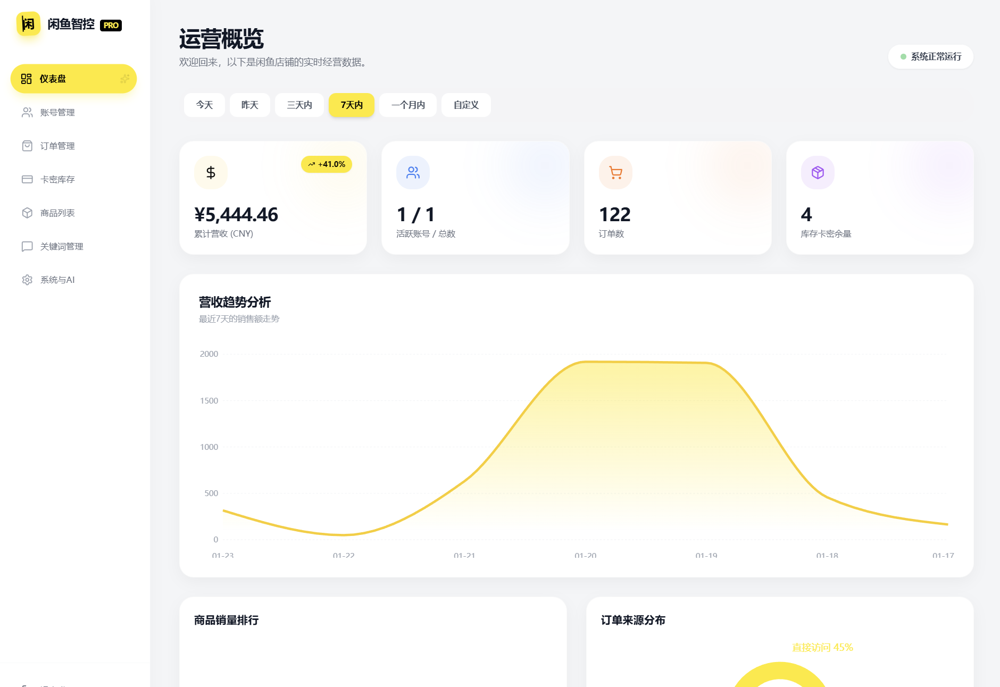
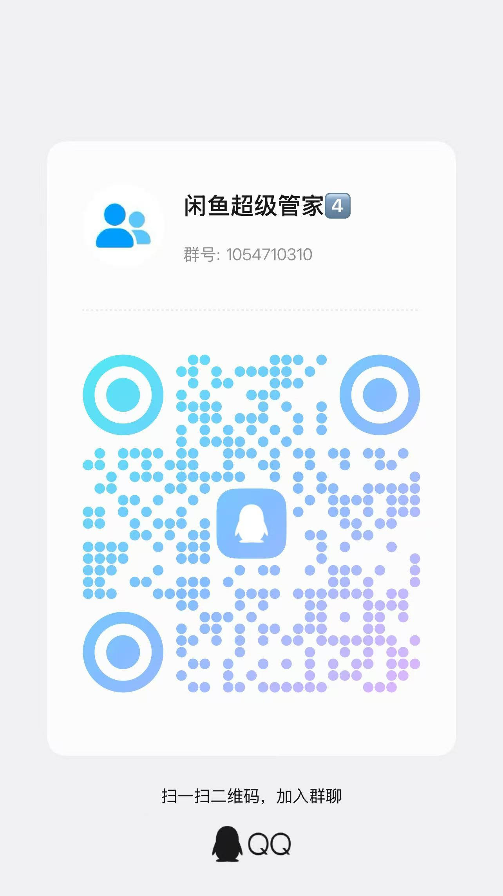
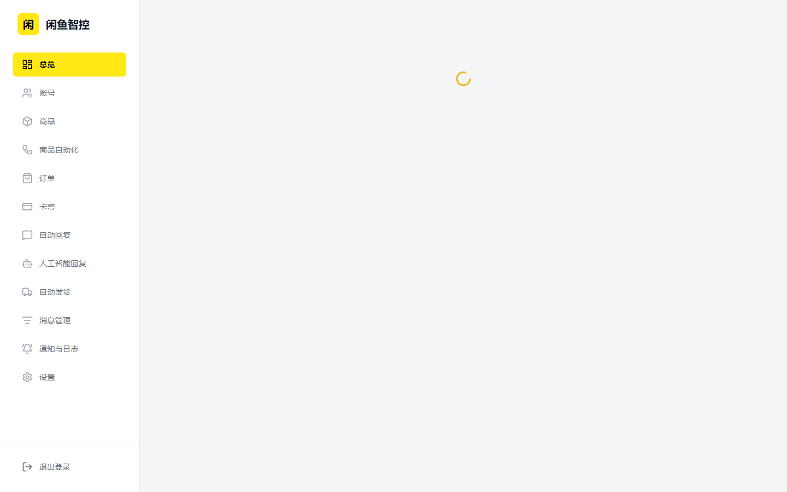
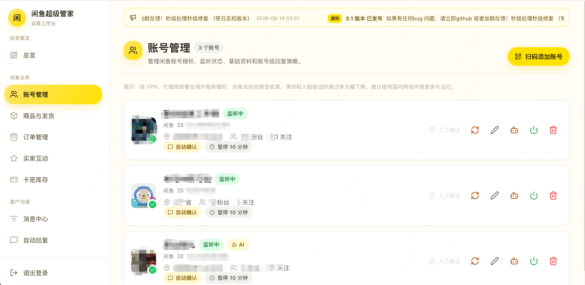
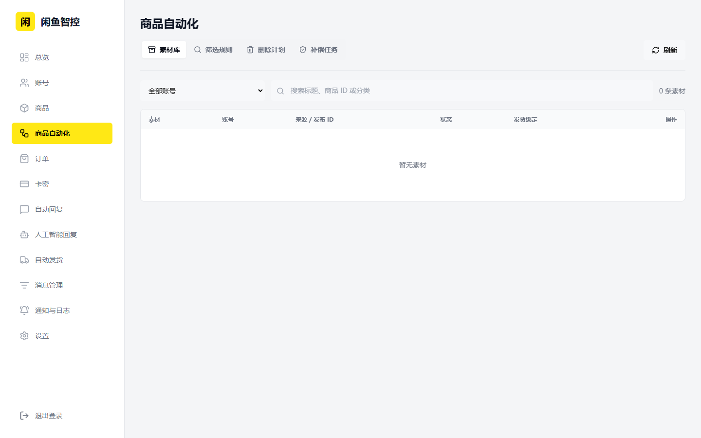
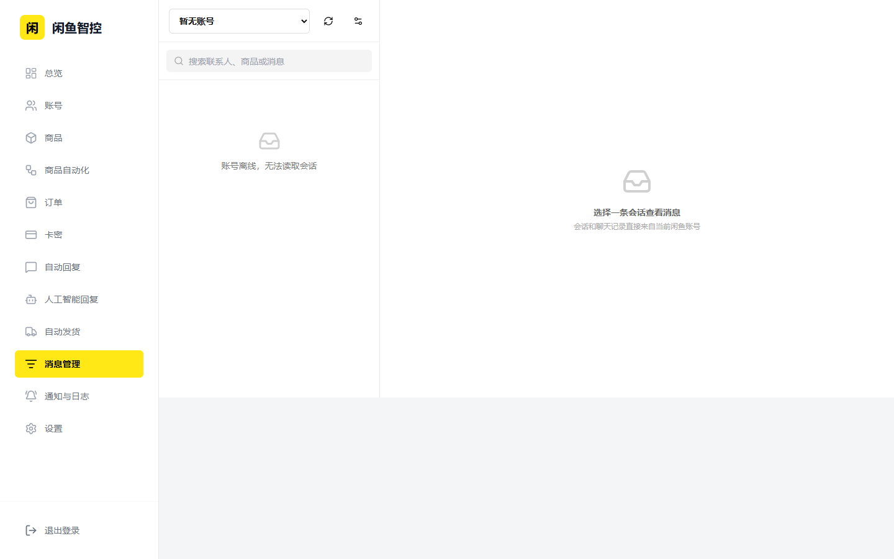
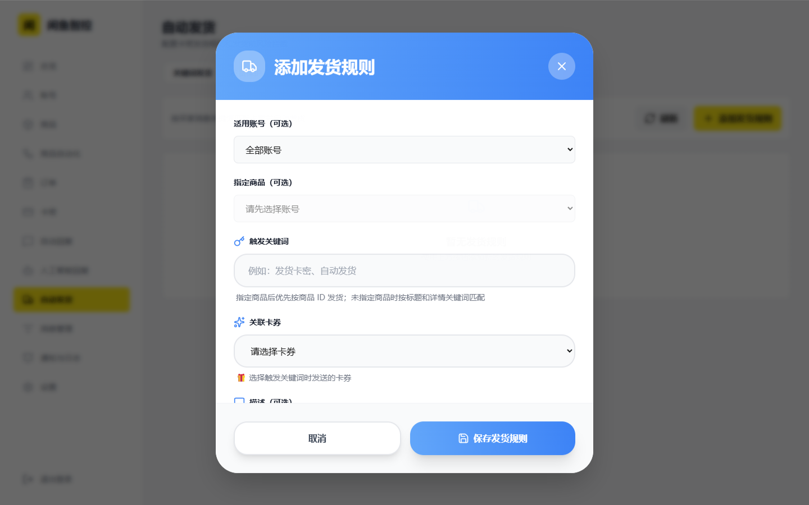
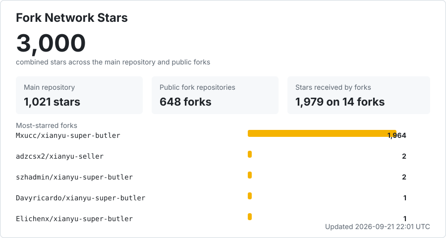

# 闲鱼智控（闲鱼超级管家）

面向闲鱼卖家的账号、商品、订单、消息、自动回复与自动发货一体化管理系统。

[](https://github.com/23Star/xianyu-super-butler/stargazers)
[](https://www.python.org/)
[](https://react.dev/)
[](LICENSE)

本项目基于 [zhinianboke/xianyu-auto-reply](https://github.com/zhinianboke/xianyu-auto-reply) 二次开发并持续维护，保留原项目核心能力，同时重构管理端、账号监听、商品同步、订单处理和发货规则。

## 项目效果



## 交流与反馈

<table>
  <tr>
    <th align="center">微信群</th>
    <th align="center">QQ群</th>
  </tr>
  <tr>
    <td align="center"></td>
    <td align="center"></td>
  </tr>
  <tr>
    <td align="center">二维码失效后会在仓库更新</td>
    <td align="center">群号：704866149</td>
  </tr>
</table>

缺陷和功能建议请提交到 [GitHub Issues](https://github.com/23Star/xianyu-super-butler/issues)。

## 核心能力

| 模块 | 当前能力 |
| --- | --- |
| 总览 | 汇总营收、账号、订单、卡密库存和运行状态 |
| 账号 | 扫码、密码或 Cookie 登录，资料同步，监听任务状态，暂停和自动回复配置 |
| 商品 | 从闲鱼同步商品，维护本地详情、图片、规格、数量和商品回复 |
| 商品自动化 | 商品筛选、素材库、发布记录、定时删除、短链修复和补偿任务 |
| 订单 | 订单同步、状态判定、详情补全、批量刷新、手动发货和异常保护 |
| 卡密 | 卡券分组、库存导入、状态管理、多规格和多数量发货 |
| 自动回复 | 账号关键词回复、默认回复和回复一次控制 |
| 人工智能回复 | 兼容 OpenAI 协议的大模型配置、上下文对话和测试 |
| 自动发货 | 全局、指定账号、指定商品三级发货规则及发货前风险拦截 |
| 消息管理 | 闲鱼会话列表、消息收发、搜索筛选、回复决策日志和过滤规则 |
| 通知与日志 | 通知渠道、账号绑定、风险日志和系统日志 |
| 设置 | 管理员、安全、服务、备份及系统配置 |

管理端导航：

`总览 → 账号 → 商品 → 商品自动化 → 订单 → 卡密 → 自动回复 → 人工智能回复 → 自动发货 → 消息管理 → 通知与日志 → 设置`

## 关键改进

### 登录后自动启动业务监听

账号扫码、密码或 Cookie 登录成功后，系统会保存有效 Cookie，并确保该账号的后台监听任务处于运行状态。监听任务负责接收买家消息、触发自动回复、识别订单事件和执行自动发货。

账号页面会分别显示：

- `在线 / 离线`：Cookie 和闲鱼连接状态
- `监听中`：后台消息与订单任务正在运行
- `监听异常`：任务意外退出，可重新登录或重新启用账号触发重启
- `已停用`：该账号被手动停用，不会处理消息和订单

仅显示“在线”但没有“监听中”时，请先查看“通知与日志”中的启动错误。

### 每个商品独立发货

自动发货规则支持三个范围：

1. `指定账号 + 指定商品`：按商品 ID 精确发货，优先级最高，关键词可留空。
2. `指定账号 + 关键词`：只匹配该账号下的商品标题、详情或买家消息。
3. `全部账号 + 关键词`：通用兜底规则。

配置路径：`自动发货 → 添加发货规则 → 选择账号 → 选择商品 → 关联卡券`。

### 单一生产入口

- 完整管理页面：`http://localhost:8080/`
- API 文档：`http://localhost:8080/docs`
- 健康检查：`http://localhost:8080/health`

生产前端由 FastAPI 直接提供，不需要单独运行 `3000` 端口。

## 界面预览

### 运营总览



### 账号与监听状态



### 商品自动化



### 闲鱼消息管理



### 单商品发货规则



## 本地安装

环境要求：

- Python 3.11+
- Node.js 20+
- npm
- Windows 10/11 或常见 Linux 发行版

```powershell
git clone https://github.com/23Star/xianyu-super-butler.git
cd xianyu-super-butler

py -3.11 -m venv .venv
.\.venv\Scripts\Activate.ps1
python -m pip install --upgrade pip
python -m pip install -r requirements.txt
playwright install chromium

cd frontend
npm ci
npm run build
cd ..

python Start.py
```

启动完成后访问 `http://localhost:8080/`。

默认管理员：

```text
用户名：admin
密码：admin123
```

首次登录后立即修改默认密码。

## Docker 部署

1. 创建环境文件：

```bash
cp .env.example .env
```

2. 修改 `.env`，至少设置强密码和随机密钥：

```dotenv
ADMIN_USERNAME=admin
ADMIN_PASSWORD=replace-with-a-strong-password
JWT_SECRET_KEY=replace-with-at-least-32-random-characters
```

3. 构建并启动：

```bash
docker compose up -d --build
docker compose ps
docker compose logs -f xianyu-app
```

国内镜像配置：

```bash
docker compose -f docker-compose-cn.yml up -d --build
```

可选 Nginx：

```bash
docker compose --profile with-nginx up -d --build
```

数据默认持久化到：

- `./data`：SQLite 数据库
- `./logs`：运行日志
- `./backups`：备份文件

## 部署失败排查

重复部署失败通常不是前端问题，优先按以下顺序检查：

1. **确认版本**：使用 Docker Engine 24+、Docker Compose v2 和至少 2 GB 可用内存。
2. **确认 `.env`**：未设置 `ADMIN_PASSWORD` 或 `JWT_SECRET_KEY` 时，Compose 会主动拒绝启动。
3. **确认端口**：`8080` 被占用时，在 `.env` 设置 `WEB_PORT=8081`，然后访问对应端口。
4. **确认目录权限**：容器必须能够写入 `data`、`logs` 和 `backups`。
5. **等待首次构建**：首次构建会安装 Python 依赖和 Playwright Chromium，网络较慢时耗时明显。
6. **检查健康状态**：运行 `docker compose ps`，健康接口应返回 `healthy`。
7. **查看真实错误**：运行 `docker compose logs --tail=200 xianyu-app`，不要只看浏览器“无法访问”。
8. **清理失败构建缓存**：确认数据已备份后运行 `docker compose build --no-cache xianyu-app`，再重新启动。

常用诊断命令：

```bash
docker compose config
docker compose ps
docker compose logs --tail=200 xianyu-app
curl http://localhost:8080/health
```

## 使用流程

1. 登录后台并修改默认管理员密码。
2. 在“账号”页面登录闲鱼账号，等待状态显示“在线”和“监听中”。
3. 在“商品”页面选择账号并同步商品。
4. 在“卡密”页面创建卡券分组并导入库存。
5. 在“自动回复”或“人工智能回复”配置客服策略。
6. 在“自动发货”中为指定商品绑定卡券，或设置账号级、全局关键词规则。
7. 在“订单”和“消息管理”页面核对实际触发结果。
8. 在“通知与日志”中排查过滤、暂停、无规则、发送失败和监听退出。

扫码登录成功后，系统会先保存已验证的核心 Cookie 并更新账号状态，再在后台补全浏览器 Cookie。商品同步会对比页面声明数量、接口解析数量和数据库保存数量，数量不一致时给出明确提示。

## 更新与验证

更新代码：

```bash
git pull
docker compose up -d --build
```

后端测试：

```powershell
.\.venv\Scripts\python.exe -m unittest discover -s tests -p "test_*.py" -v
.\.venv\Scripts\python.exe -m compileall -q Start.py XianyuAutoAsync.py app utils tests
```

前端检查：

```powershell
cd frontend
.\node_modules\.bin\tsc.cmd --noEmit
npm run build
```

## 数据与安全

- 不要提交数据库、日志、Cookie、Token、卡密、浏览器状态和本地配置。
- 日志不得输出完整 Cookie、Authorization、签名或模型 API Key。
- 自动发货、发送卡密、删除商品等操作应先用测试账号验证。
- 闲鱼页面和接口可能随平台更新变化，升级后应重新验证登录、消息、商品和订单链路。
- 当前仍兼容旧版无盐 SHA-256 密码哈希，不建议未经额外防护直接暴露到公网。

## 技术栈

- 后端：FastAPI、Python 3.11、SQLite、Playwright、WebSocket、Asyncio
- 前端：React 19、TypeScript、Vite、Tailwind CSS
- 部署：Docker Compose，可选 Nginx

## 许可与声明

项目使用 [GNU Affero General Public License v3.0](LICENSE)。修改、部署或通过网络提供服务时，请遵守 AGPL-3.0 的源代码公开义务。

本项目仅供学习、研究和合法自动化使用。使用者应遵守法律法规及平台规则，并自行承担使用风险。

## Star History

<a href="https://www.star-history.com/?type=date&repos=23Star%2Fxianyu-super-butler">
  <picture>
    <source media="(prefers-color-scheme: dark)" srcset="https://api.star-history.com/chart?repos=23Star/xianyu-super-butler&type=date&theme=dark&legend=top-left&sealed_token=AhEE4dCbaUSe6lOSCJhYlDz04x4r2C14buYVYWlJVlulk23LKk5DgHZfMIumVkiNUPsbFO--8IX-0pXCfW8nyyEN3NStTE-16pBQggRCq6gsUZRlegeZdTbWWU-UPKWAWlnyyQyndGhz-lPX0HJrKxSCriOB1fiyJljBO7eNsd4xVYkrByhViWaPMCv9" />
    <source media="(prefers-color-scheme: light)" srcset="https://api.star-history.com/chart?repos=23Star/xianyu-super-butler&type=date&legend=top-left&sealed_token=AhEE4dCbaUSe6lOSCJhYlDz04x4r2C14buYVYWlJVlulk23LKk5DgHZfMIumVkiNUPsbFO--8IX-0pXCfW8nyyEN3NStTE-16pBQggRCq6gsUZRlegeZdTbWWU-UPKWAWlnyyQyndGhz-lPX0HJrKxSCriOB1fiyJljBO7eNsd4xVYkrByhViWaPMCv9" />
    
  </picture>
</a>

Star 历史曲线实时读取 GitHub 数据，不需要人工更新。

## Fork 网络总 Star

[](https://github.com/23Star/xianyu-super-butler/network/members)

该统计在主仓库 Star 之外累加全部公开 Fork 获得的 Star，每 6 小时自动刷新。由于同一用户可能同时 Star 多个仓库，此处是各仓库 Star 数之和，并非去重后的独立用户数。
