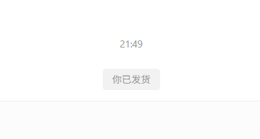

# 闲鱼智控（闲鱼超级管家）

闲鱼账号、商品、订单、卡密、自动回复与自动发货的一体化管理系统。

[](https://github.com/23Star/xianyu-super-butler)
[](https://www.python.org/)
[](https://react.dev/)

本项目基于 [zhinianboke/xianyu-auto-reply](https://github.com/zhinianboke/xianyu-auto-reply) 二次开发并持续维护。

## 界面预览

### 工作台


### 订单管理


### 立即发货




## 当前功能

- 总览：账号、商品、订单、卡密和服务状态汇总
- 账号管理：扫码、密码或 Cookie 登录，账号状态、头像和资料同步
- 商品管理：从闲鱼账号同步商品，在本地维护详情、图片、规格、数量及发货策略
- 订单管理：同步订单、统一状态判定、查看详情及执行手动补发
- 卡密管理：库存导入、查询、使用状态与商品关联
- 自动回复：关键词回复、默认回复及 AI 回复配置
- 自动发货：独立维护关键词发货规则和卡密发放策略
- 系统设置：管理员、安全、服务及模型配置

当前导航顺序：

`总览 → 账号 → 商品 → 订单 → 卡密 → 自动回复 → 自动发货 → 设置`

## 应用入口

系统只使用一个完整应用入口：

- 管理页面：`http://localhost:8080/`
- API 文档：`http://localhost:8080/docs`
- 健康检查：`http://localhost:8080/health`

前端生产文件由 FastAPI 在 `8080` 端口提供。项目不需要也不支持单独启动 `3000` 端口的前端开发服务器。

## 本地启动

环境要求：

- Python 3.11+
- Node.js 20+
- npm

```powershell
git clone https://github.com/23Star/xianyu-super-butler.git
cd xianyu-super-butler

py -3.11 -m venv .venv
.\.venv\Scripts\Activate.ps1
python -m pip install -r requirements.txt
playwright install chromium

cd frontend
npm install
npm run build
cd ..

python Start.py
```

启动完成后访问 `http://localhost:8080/`。

前端代码修改后只需重新执行：

```powershell
cd frontend
npm run build
cd ..
python Start.py
```

## Docker 启动

```bash
docker compose up -d --build
```

使用国内镜像配置：

```bash
docker compose -f docker-compose-cn.yml up -d --build
```

启用可选的 Nginx 反向代理：

```bash
docker compose --profile with-nginx up -d --build
```

## 默认登录

```text
用户名：admin
密码：admin123
```

首次登录后应立即修改默认密码。生产部署还必须设置随机且足够强的 `JWT_SECRET_KEY`，不要继续使用 Compose 文件中的默认值。

当前版本仍保留旧版无盐 SHA-256 密码哈希兼容逻辑，不建议直接暴露在公网。后续应迁移至 Argon2id 或 bcrypt，并加入首次登录强制改密。

## 使用流程

1. 登录管理后台并修改默认管理员密码。
2. 在“账号”页面通过扫码、密码或 Cookie 登录闲鱼账号。
3. 等待账号状态变为在线，并核对头像、昵称和闲鱼 ID。
4. 在“商品”页面选择账号并同步闲鱼商品。
5. 为商品维护本地详情、规格、数量和发货策略。
6. 在“卡密”页面导入库存。
7. 分别在“自动回复”和“自动发货”页面配置回复及发货规则。
8. 在“订单”页面同步订单并核对状态。

扫码成功后，系统会先保存已验证的核心 Cookie 并快速更新账号状态，再在后台补充浏览器 Cookie。商品同步会对比闲鱼页面声明数量、接口解析数量和数据库保存数量，数量不一致时给出明确提示。

## 验证

后端测试与编译检查：

```powershell
.\.venv\Scripts\python.exe -m unittest discover -s tests -p "test_*.py" -v
.\.venv\Scripts\python.exe -m compileall -q Start.py XianyuAutoAsync.py app utils tests
```

前端类型与生产构建：

```powershell
cd frontend
npx tsc --noEmit
npm run build
```

## 技术栈

- 后端：FastAPI、Python 3.11、SQLite、Playwright、WebSocket、Asyncio
- 前端：React 19、TypeScript、Vite、Tailwind CSS
- 部署：Docker Compose，可选 Nginx 反向代理

## 数据与隐私

- 数据库、日志、浏览器状态、Cookie、Token 和本地配置不应提交到 Git。
- 日志不得输出 Cookie、Token、Sign 或 Authorization 明文。
- 执行自动发货、发送卡密、删除商品等操作前，请先在测试账号验证规则。
- 闲鱼页面及接口可能随平台更新发生变化，升级后应重新执行账号登录、商品同步和订单同步测试。

## 许可与声明

本项目仅供学习、研究和合法的个人自动化使用。使用者应遵守相关法律法规及平台规则，并自行承担使用产生的风险。

## Star History

[](https://star-history.com/#23Star/xianyu-super-butler&Date)

图表由 Star History 根据 GitHub 数据动态生成，无需仓库任务或人工更新。
